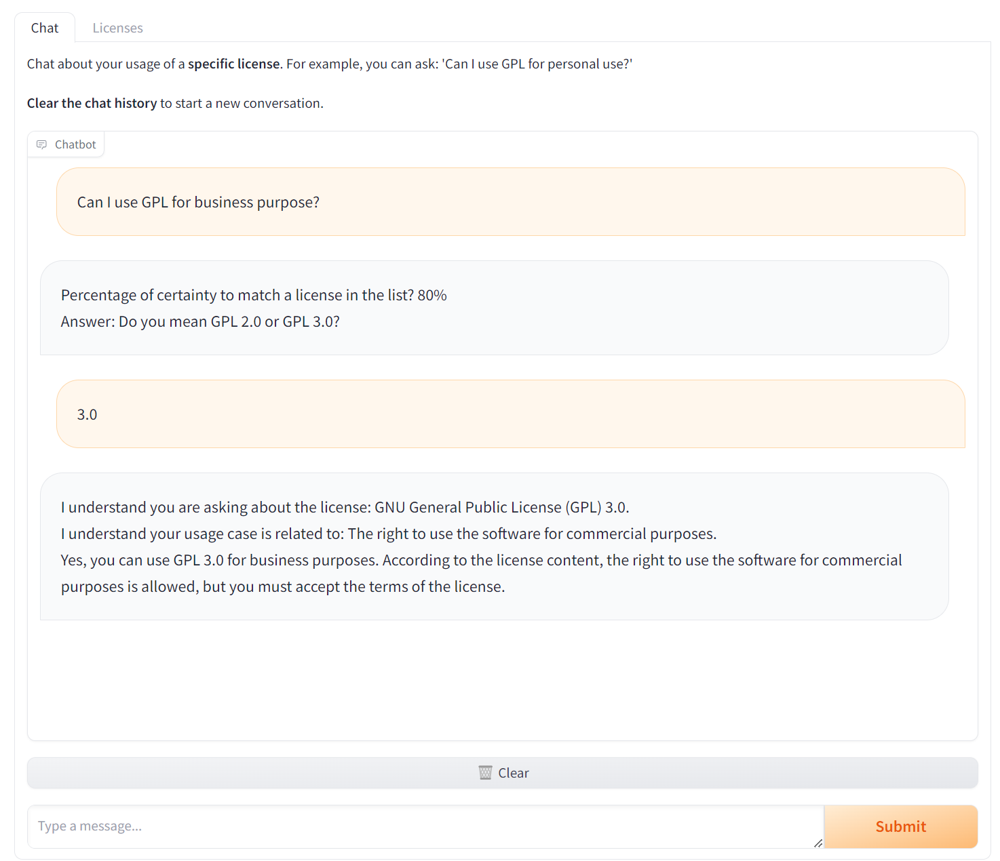
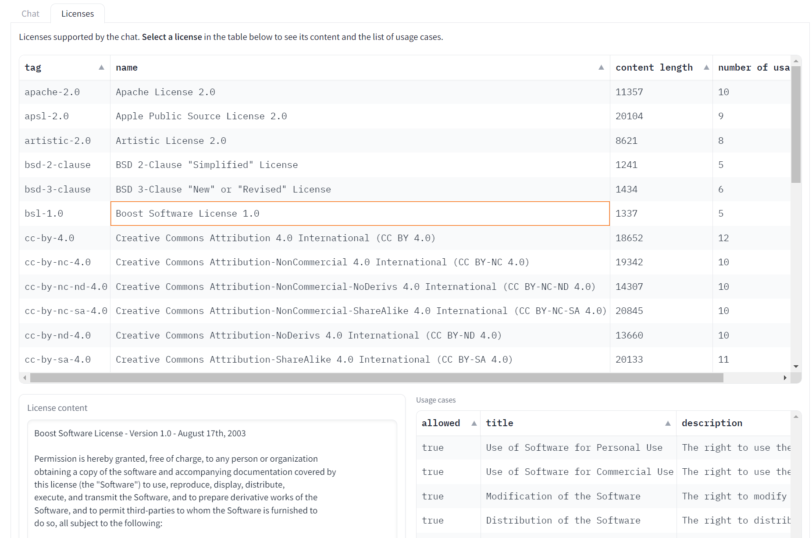

# L'Agent

L'Agent is an open-source license assistant capable of answering questions about the usage of a license. 

## Context
  
Understanding legal documents is not easy. They are written by experts, for experts, using expert vocabulary.
  
When used directly AI could not be trusted enough for legal advice.

## Solution

L'Agent preprocesses licenses by generating all usage cases related to each license, using a Large Language Model (LLM) with structured output.

These use cases can be verified and corrected by a legal expert.

L'Agent chat uses only these certified usage cases to respond to user requests.

L'Agent states its asumptions about which license and which usage case is used to provide the answer, ensuring that the user is responsible for the shared understanding of the request, and the validity of the answer.


Chat workflow
  1. Initial question from the user.
  2. L'Agent interacts until the license is fully identified.
  3. Then L'Agent interacts until a usage case of this license matches the user's usage case
  4. Then L'Agent provides the answer using this usage case.

L'Agent is preloaded with 32 open-source software licenses for demonstration purpose.

# Install

* Define environment variables inside a .env file

```sh
# Environment variables for the LANG SMITH
LANGCHAIN_TRACING_V2=true
LANGCHAIN_API_KEY=

# Environment variables for the NVIDIA NIM API
NVIDIA_API_KEY=
```

* Setup a virtual env

```sh
python3.10 -m venv venv
source venv/bin/activate
pip install -r requirements
```

* Launch the Gradio app
  * '-s' option allows to share the local gradio app with others

```sh
python app.py -h
```

* Use the command line interface (CLI) for generating usage cases for a license

```sh
python cli.py -h
```

# Usage

## Chat app

Launch the Chat app
```sh
python app.py -s
```

The Chat app has two tabs:
* The chat interface: You can chat about your usage of a specific license.
  * For example, you can ask: 'Can I use GPL for personal use?'
  * You must clear the chat history ("clear" button) to start a new conversation and reset the context from the previous one.



* The license database: Displays all the licenses supported by the chat.
  * Select a license in the table to see its content and the list of usage cases.



## CLI for preprocessing 

* Run the usage case generator on a specific license

```sh
python cli.py -t cecill-2.1
```

* Licenses are listed in the file 

```sh
./data/licenses_and_link.yaml
```

Note: This file is generated by OpenAI ChatGPT 4o with the following prompt:

```text
List all open source licenses, for each provide a link to the license text and a unique tag, output format must be yaml
```

* You can add a new license by modifying this file
* License contents are in the directory:

```sh
./data/licenses_text
```

* You can add the content of a new license in this directory, file name format is ```[license_tag].txt ```

* You can run the usage case generator on all licenses:

```sh
python cli.py -a
```

* You can list all license tags:

```sh
python cli.py -l
```

## Contributing

PRs accepted.

## License

MIT © Olivier Pizzato